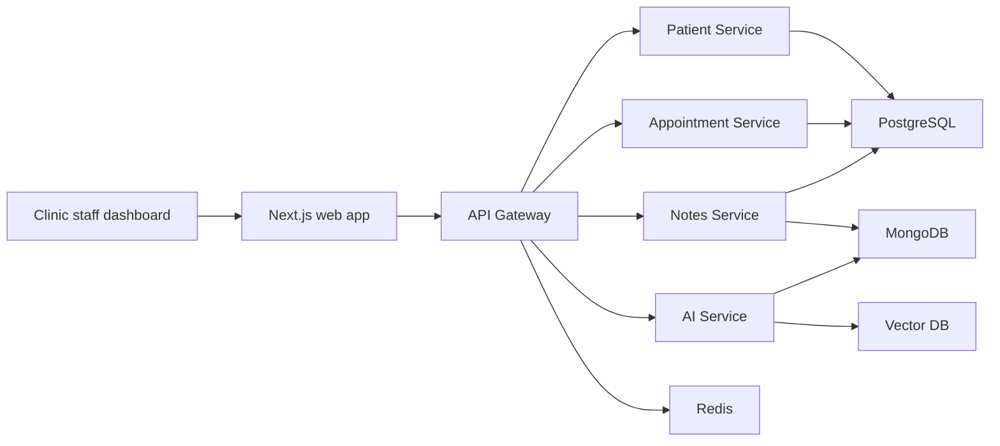

# Clinic AI Copilot

Clinic AI Copilot is a staged training project for building an AI-enabled medical operations platform. The system will help clinic staff manage patients, appointments, medical notes, and AI-assisted summaries while keeping human review in control.

## Project Status

Current stage: Stage 2 - repository structure and project conventions.

Completed:

- Stage 0 domain summary
- Stage 1 development environment check
- Initial monorepo skeleton

## Architecture Overview



## Repository Structure

```text
apps/
  web/                       Next.js clinic staff dashboard
services/
  api-gateway/               Public backend entry point, validation, auth, routing
  patient-service/           Patient profile and registration workflows
  appointment-service/       Appointment scheduling workflows
  notes-service/             Medical note metadata and note workflows
  ai-service/                Summarization, semantic search, assistant workflows
packages/
  shared/                    Shared types, constants, and utilities
infra/
  docker/                    Local Docker assets and compose-related files
  deployment/                Staging/cloud deployment manifests and notes
docs/                        Project planning, stage notes, and architecture docs
```

## Technology Stack

- Frontend: Next.js
- Backend: Node.js / NestJS
- SQL database: PostgreSQL
- NoSQL database: MongoDB
- Cache and queues: Redis
- AI memory: vector database
- Local infrastructure: Docker Compose

## Local Setup

The implementation packages will be added in later stages. For now, verify the base tools:

```powershell
node -v
yarn -v
git --version
docker --version
docker compose version
```

## Environment Variables

Copy `.env.example` to `.env` when local services are introduced.

Never commit real secrets.

## Development Conventions

- Keep app code in `apps/`.
- Keep independently deployable backend modules in `services/`.
- Keep reusable internal code in `packages/`.
- Keep Docker and deployment assets in `infra/`.
- Keep project notes, stage deliverables, and architecture records in `docs/`.
- Prefer small vertical slices that prove frontend, API, and storage communication before adding complexity.

## Current Documentation

- [Domain summary](docs/Domain_Summary.md)
- [Stage 1 environment check](docs/STAGE_1_ENVIRONMENT_CHECK.md)

## Known Limitations

- Application packages have not been generated yet.
- Docker Compose services have not been defined yet.
- Databases and AI workflows will be introduced in later stages.
