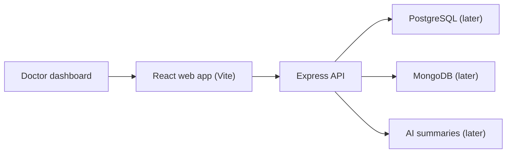

# Clinic AI Copilot

Clinic AI Copilot is a staged training project for building a simple AI-assisted clinic workspace for a single role: the doctor. The system helps a doctor manage patients, medical notes, and AI-assisted summaries while keeping human review in control.

## Project Status

Current stage: Stage 3 - frontend design slice.

Completed:

- Stage 0 domain summary
- Stage 1 development environment check
- Initial monorepo skeleton
- React (Vite) doctor dashboard design
- Express health and patients API

## Architecture Overview



## Repository Structure

```text
apps/
  web/                       React (Vite) doctor dashboard
services/
  api/                       Express backend (health, patients, AI workflows later)
packages/
  shared/                    Shared constants and utilities
infra/
  docker/                    Local Docker assets and compose-related files
  deployment/                Staging/cloud deployment manifests and notes
docs/                        Project planning, stage notes, and architecture docs
```

## Technology Stack

- Language: JavaScript only (no TypeScript)
- Frontend: React with Vite
- Backend: Node.js with Express
- SQL database: PostgreSQL (later stage)
- NoSQL database: MongoDB (later stage)
- AI: summarization and semantic search (later stage)
- Local infrastructure: Docker Compose (later stage)

## Local Setup

Verify the base tools:

```bash
node -v
yarn -v
git --version
docker --version
docker compose version
```

Install dependencies:

```bash
yarn install
```

Run the backend API:

```bash
yarn api:dev
```

Run the frontend (in a second terminal):

```bash
yarn web:dev
```

Then open:

```text
http://localhost:3000
```

The frontend calls the Express API on `http://localhost:3001` by default. Keep
`yarn api:dev` running while using the web app. To point the frontend at a
different API host, set `VITE_API_BASE_URL`.

## Environment Variables

Copy `.env.example` to `.env` when local services are introduced.

Never commit real secrets.

The API reads `MONGO_URL` from `.env` and connects to MongoDB Atlas with Mongoose.
After configuring `MONGO_URL`, seed shared development patients with:

```bash
yarn api:seed
```

The seed command also creates the demo doctor account:

```text
doctor@clinikit.local
clinic-demo-2026
```

## Development Conventions

- Use JavaScript only; do not add TypeScript.
- Keep the app simple and focused on a single role: doctor.
- Keep app code in `apps/`.
- Keep the backend in `services/api`.
- Keep reusable internal code in `packages/`.
- Keep Docker and deployment assets in `infra/`.
- Keep project notes, stage deliverables, and architecture records in `docs/`.
- Prefer small vertical slices that prove frontend, API, and storage communication before adding complexity.

## Current Documentation

- [Project plan](docs/PROJECT_PLAN.md)

## Known Limitations

- The frontend and API currently use mock data only.
- Databases and AI workflows will be introduced in later stages.
- Docker Compose services have not been defined yet.
