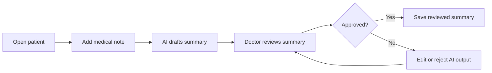

# Domain Summary: Clinic AI Copilot

## Product Overview

Clinic AI Copilot is a simplified medical workspace for a single role: the doctor. It helps a doctor manage patients, capture medical notes, and use AI to summarize or search clinical information. The system is designed to support the doctor's workflow, not replace clinical judgment.

The first product goal is a small, reliable workflow: the doctor opens a patient, adds a medical note, the AI service generates a draft summary, and the doctor decides whether the AI output is accepted.

## Main User

- Doctor: the only role in this simplified app. The doctor reviews patient context, writes medical notes, and validates AI-generated summaries.

## Core Workflow

## Sensitive Data To Protect

- Patient identity: name, date of birth, contact details, address, national ID, insurance ID.
- Medical information: symptoms, diagnoses, medications, allergies, lab results, imaging notes, medical history.
- Operational records: appointment details, staff actions, audit logs, internal comments.
- AI records: prompts, generated responses, retrieved context, embeddings metadata, review decisions.
- Authentication and infrastructure secrets: passwords, API keys, database URLs, tokens, private keys.

## AI Assistance Boundaries

AI is allowed to:

- Draft summaries from medical notes.
- Suggest structured highlights such as symptoms, medications, follow-up items, and missing context.
- Support semantic search over previous notes or approved clinic knowledge.
- Help the doctor find relevant historical information faster.

AI must not:

- Make final diagnoses.
- Prescribe treatment.
- Approve or modify medical records without the doctor's review.
- Hide uncertainty or present generated content as verified fact.
- Use real patient data in development, demos, logs, or training examples.

## Human Review Rule

Every AI output should be stored with a clear review status:

- Draft: generated by AI and not yet reviewed.
- Edited: modified by the doctor.
- Approved: accepted by the doctor.
- Rejected: not suitable for use in the patient record.

The interface should make this state visible so the doctor understands whether content is AI-generated or clinically reviewed.

## Summary

Clinic AI Copilot is a doctor dashboard for managing basic clinic workflows and responsibly adding AI support. The platform keeps structured clinic data, such as patients and notes, in a reliable SQL database, while storing activity history, AI conversations, and unstructured notes in a NoSQL database. An AI service can summarize medical notes and help the doctor search previous context semantically, but all AI output remains draft content until the doctor reviews it.
